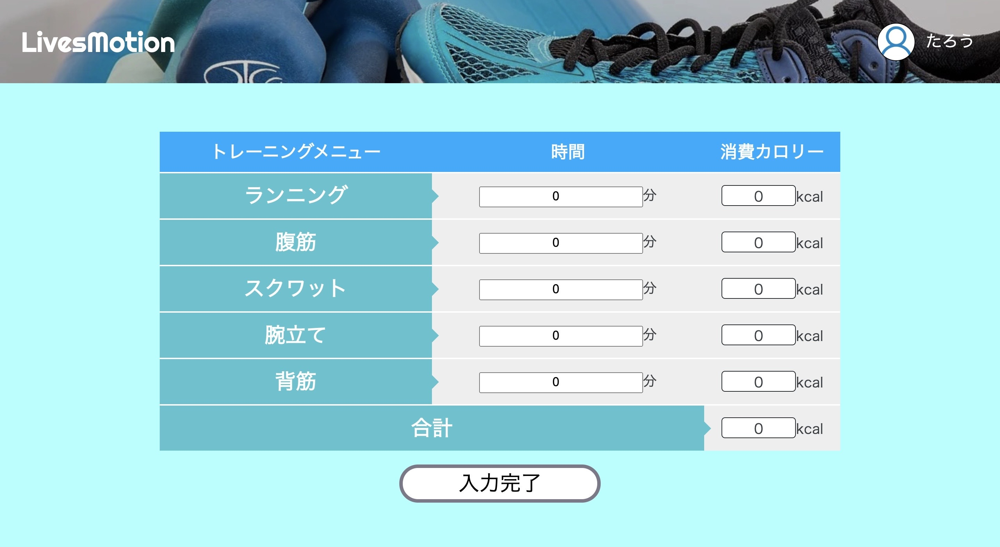
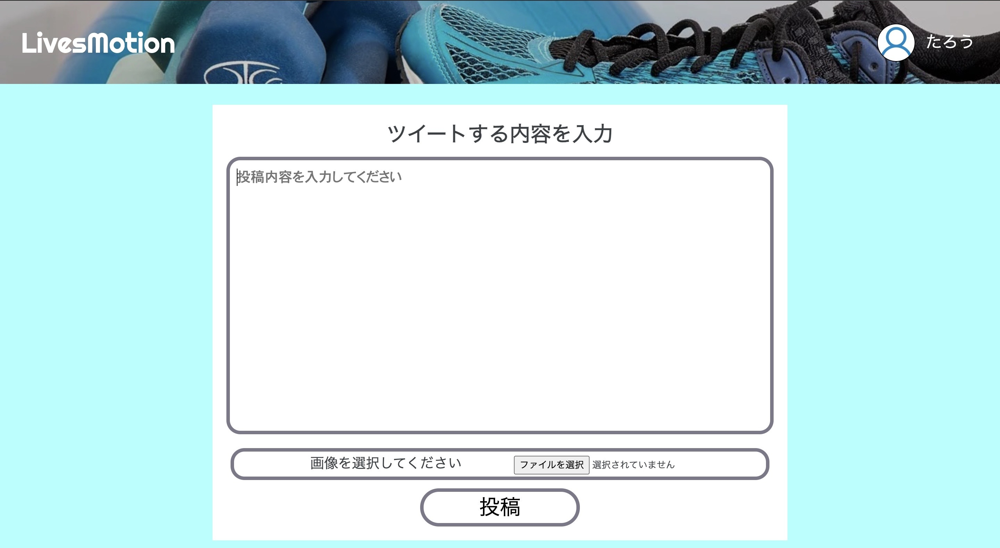
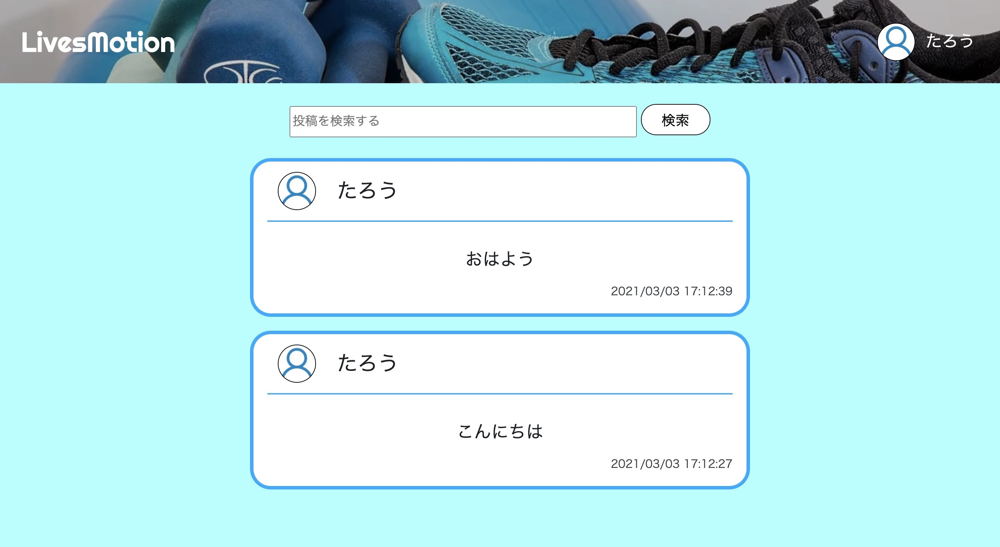
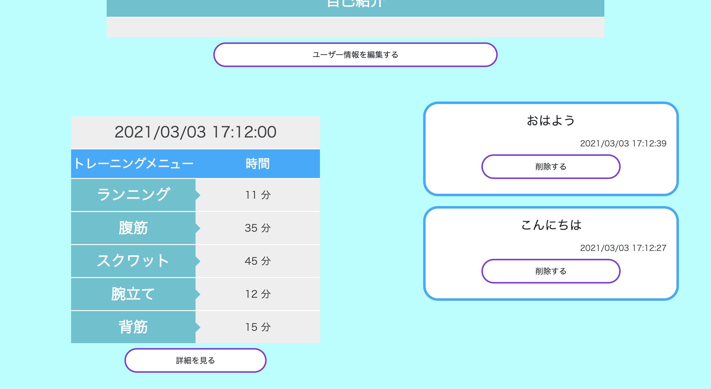
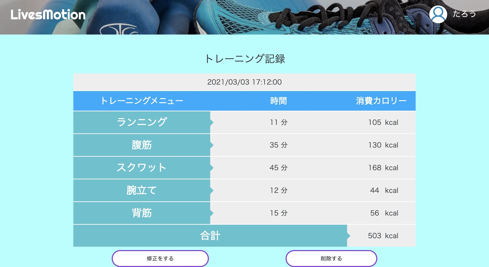
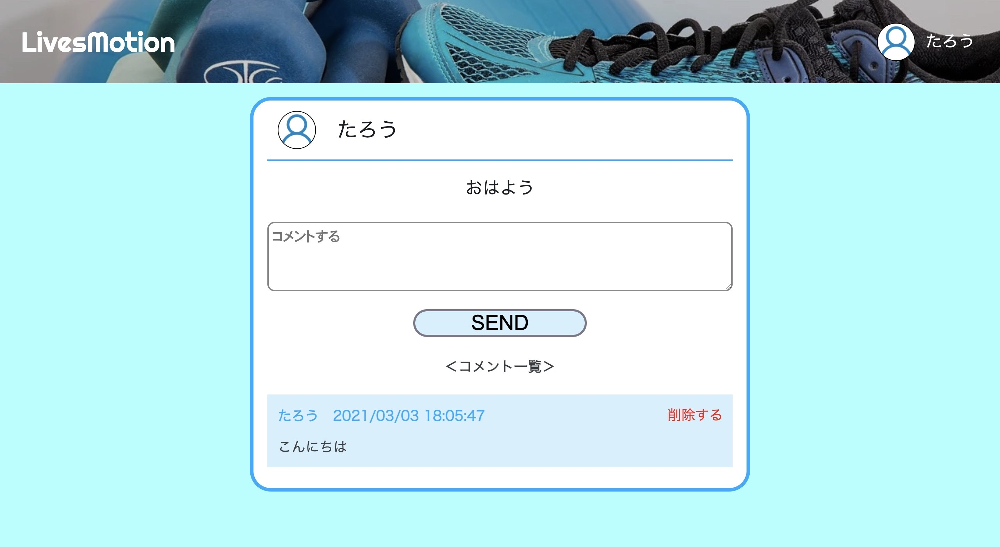

# README

## 💬 Usage

`% git clone https://github.com/shingo04/lives_motion.git`

## アプリ名
# Lives Motion

## アプリ概要
ランニングや腹筋などのトレーニングを記録することのできるアプリです。
さらにツイート機能があり、トレーニングの方法や記録を共有することができます。

## 🌐 App URL

### http://18.181.126.31/

#### Basic認証
・ID: inori  
・Pass: 0137

#### テスト用アカウント
・メールアドレス: aa@com  
・パスワード: 111111

## 利用方法
ログインし、右上の名前をクリックするとメニューが開きます。その中のツイートボタンや、トレーニングボタンを押すと機能を使用することができます。

## 制作背景
運動のモチベーションを保つことが難しいひとや、トレーニングの記録をつけたい人が使うことを想定しています。
日々のトレーニングの記録をつけて、努力したことを数値で可視化したり、ツイート機能で繋がりを作ることでモチベーションを向上させていくことが目的です。

# DEMO
### トレーニング入力ページ

ここに入力した記録はマイページ下部で記録したユーザーのみが見ることができます。

### ツイート入力ページ

ここに入力した画像データや文字はツイート一覧ページに表示されます。

### ツイート一覧ページ

ツイートを投稿したらこのページに全ユーザーのツイートが表示されます。

### マイページ

登録したユーザー情報と投稿したツイートをトレーニング記録を見ることができます。
ユーザー情報は編集・削除することができます。

### マイページのツイートとトレーニング記録

ツイートとトレーニング記録ともにクリックをすると詳細ページに移動することができます。

### トレーニング詳細ページ

編集ボタンを押すと数値の変更をすることができます。削除ボタンを押すとダイアログが表示され「OK」を選択すると削除できます。

### ツイート詳細ページ

ここではツイートに対してコメントをすることができます。またコメントの削除ボタンは、コメントした本人以外には表示されません。

## 工夫したポイント

トレーニングをして時間を入力すると、その場で計算を表示するようにしました。

## 開発環境
Ruby / Ruby on Rails / MySQL / GitHub / AWS / Visual Studio Code /

## 今後実装したい機能
気になったユーザーのフォローすることができる機能を実装したいと思っています。

# テーブル設計

## usersテーブル

| columns      | type    | options     |
| ------------ | ------- | ----------- |
| email        | string  | null: false |
| password     | integer | null: false |
| nickname     | string  | null: false |
| age          | integer | null: false |
| height       | integer | null: false |
| weight       | integer | null: false |
| introduction | text    |             |

### Associations
- has_many :motions
- has_many :tweets
- has_many :comments

## motionsテーブル

| columns  | type       | options                        |
| -------- | ---------- | ------------------------------ |
| run      | integer    |                                |
| abs      | integer    |                                |
| squat    | integer    |                                |
| push_ups | integer    |                                |
| spine    | integer    |                                |
| total    | integer    | null: false                    |
| user     | references | null: false, foreign_key: true |

### Associations
- belongs_to :user

## tweetsテーブル

| columns | type       | options                        |
| ------- | ---------- | ------------------------------ |
| content | integer    | null: false                    |
| user    | references | null: false, foreign_key: true |

### Associations
- belongs_to :user
- has_many   :comments

## commentsテーブル

| columns | type       | options                        |
| ------- | ---------- | ------------------------------ |
| comment | string     | null: false                    |
| user    | references | null: false, foreign_key: true |
| tweet   | references | null: false, foreign_key: true |

### Associations
- belongs_to :user
- belongs_to :tweet
